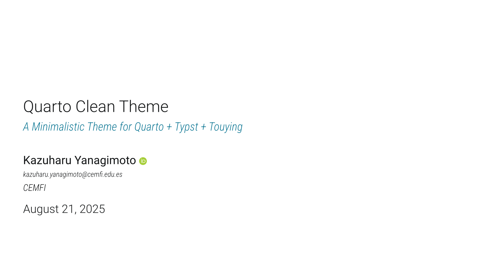

# Quarto-Clean-Typst Format

A minimalistic presentation theme for Quarto + Typst +
[Touying](https://touying-typ.github.io). Theme design is deeply
inspired by Grant McDermott’s [Clean
theme](https://github.com/grantmcdermott/quarto-revealjs-clean) for
Quarto + Reveal.js.

Click the image below to see a long
[demo](https://kazuyanagimoto.com/quarto-clean-typst/template-full.pdf).
Code is available
[here](https://github.com/kazuyanagimoto/quarto-clean-typst/blob/main/template-full.qmd).

[](https://kazuyanagimoto.com/quarto-clean-typst/template-full.pdf)

## Install

If you would like to add the clean theme to an existing directory:

``` bash
quarto install extension kazuyanagimoto/quarto-clean-typst
```

or you can use a Quarto template that bundles a .qmd starter file:

``` bash
quarto use template kazuyanagimoto/quarto-clean-typst
```
