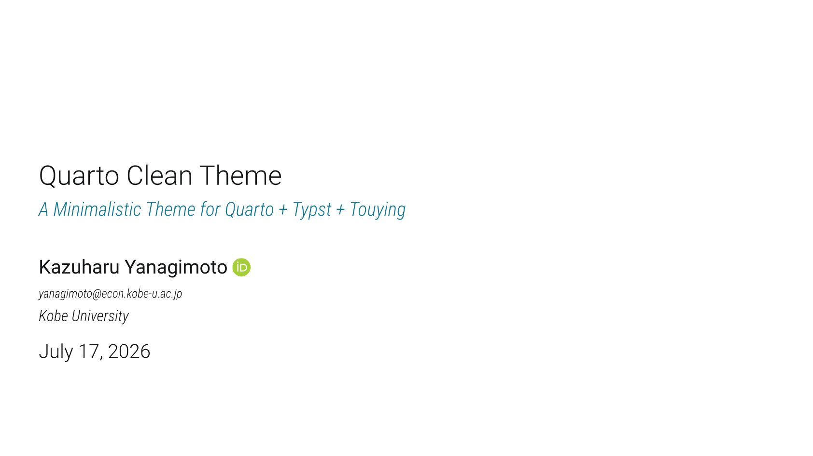

# Quarto-Clean-Typst Format

A minimalistic presentation theme for Quarto + Typst + [Touying](https://touying-typ.github.io).
Theme design is deeply inspired by Grant McDermott's [Clean theme](https://github.com/grantmcdermott/quarto-revealjs-clean) for Quarto + Reveal.js.

````{=markdown}
> [!IMPORTANT]
> **The Quarto + Touying bridge is moving to [quarto-touying-typst](https://github.com/kazuyanagimoto/quarto-touying-typst).**
>
> That extension wires Quarto's slide syntax onto Touying for *any* Touying theme. This clean theme now lives in its own Typst Universe package, [`touying-quarto-clean`](https://typst.app/universe/package/touying-quarto-clean), and you can use it there as an external theme:
>
> ```yaml
> format:
>   touying-typst:
>     include-in-header:
>       text: |
>         #import "@preview/touying-quarto-clean:0.2.0": *
>     theme-typst: clean-theme
> ```
>
> This repository is being narrowed, step by step, to that theme package.
>
> The `clean-typst` format here keeps working, so existing decks need no changes. New bridge features, however, land in `quarto-touying-typst`, so please prefer it for new decks.
````

Click the image below to see a long [demo](https://kazuyanagimoto.com/quarto-clean-typst/template-full.pdf).
Code is available [here](https://github.com/kazuyanagimoto/quarto-clean-typst/blob/main/template-full.qmd).

```{bash}
#| label: thumbnail
#| include: false
quarto render template-full.qmd -M keep-typ:true
typst compile template-full.typ static/img/thumbnail.svg --format svg --pages 1
typst compile template-full.typ static/img/thumbnail.png --format png --pages 1
```

[](https://kazuyanagimoto.com/quarto-clean-typst/template-full.pdf)

## Install


If you would like to add the clean theme to an existing directory:

```bash
quarto install extension kazuyanagimoto/quarto-clean-typst
```

or you can use a Quarto template that bundles a .qmd starter file:


```bash
quarto use template kazuyanagimoto/quarto-clean-typst
```


